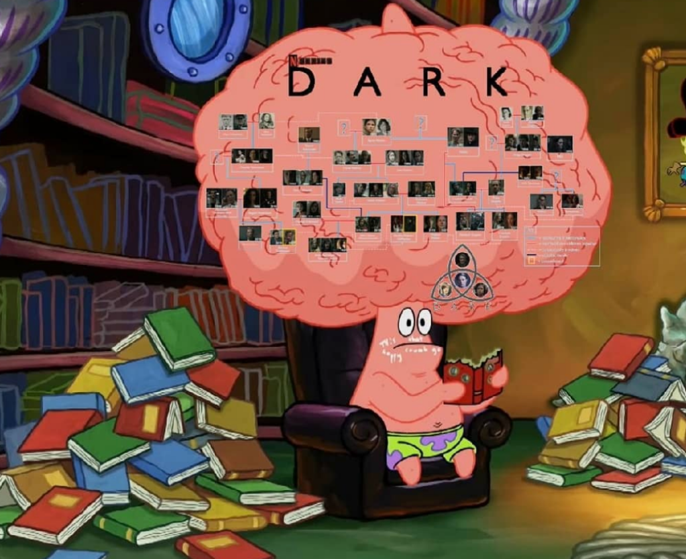

# DARK HELPER

Until today there have been many revolutions: the industrial revolution, the Arab spring, the American revolution ...

Today we are going to create a new one! Remember you are watching **Dark** and continually having to be pausing and looking for the characters, biography, the family tree ... Well, friend! This is over! With **DARK HELPER** you can see in real time who the hell those characters are, who their fucking mother is and why the hell he's young now.

We want times of peace, we want to see dark without having the anxiety of not understanding anything.




**Dark helper** allows you to capture a piece of the screen or the full screen and it will tell you who appears in each scene. Isn't it fucking gorgeous?

```
[](https://www.youtube.com/watch?v=YvRi2yq_89Y)
```


# How to use it?

You must assume that this program is hard drugs.

To install dark helper, just create a new environment and install everything you need.

```bash
# Create env
conda create --name dark_helper python=3.8
conda activate dark_helper

# Install
pip install -r requirements.txt

# Run
python main.py
```

# CREDITS

* Face detection & recognition: https://github.com/timesler/facenet-pytorch/
* Tracker: https://github.com/abewley/sort
